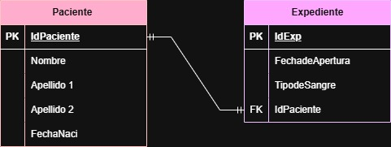
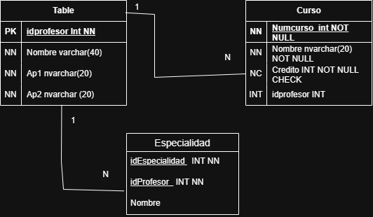
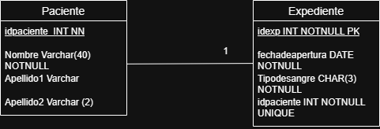
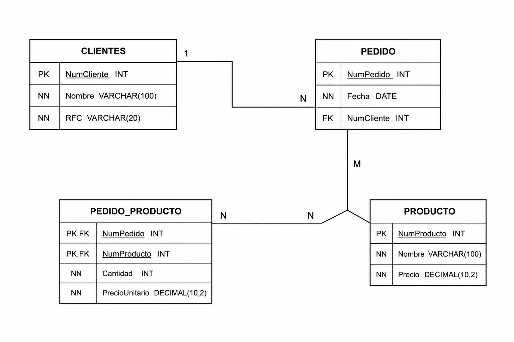
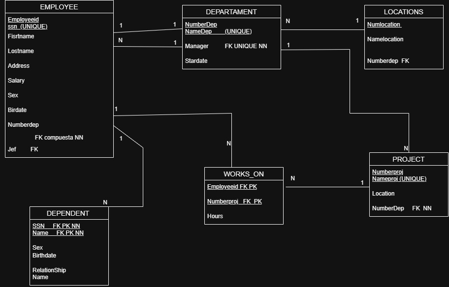
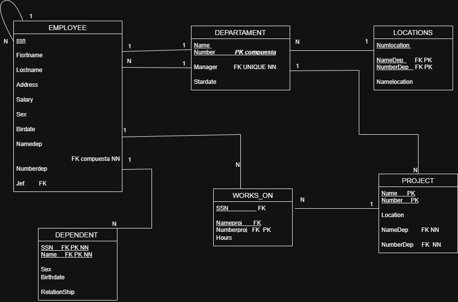
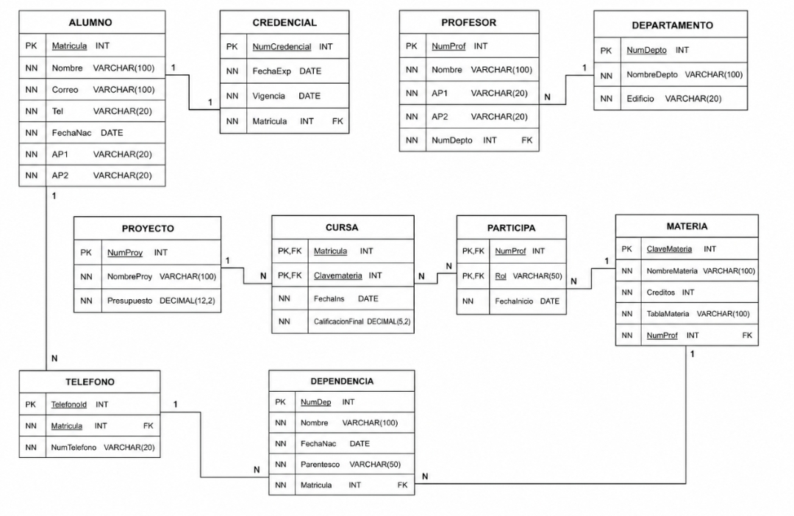

# Ejercicios Modelo Relacional ###Eduardo

## Ejercicio 1:

### Solución del ejercicio

## Ejercicio 2:

### Solución del ejercicio

## Ejercicio 3:

### Solución del ejercicio

## Ejercicio 4:

### Solución del ejercicio

## Ejercicio 5:

### Solución del ejercicio

## Ejercicio 6:

### Solución del ejercicio

## Ejercicio 7:

### Solución del ejercicio

